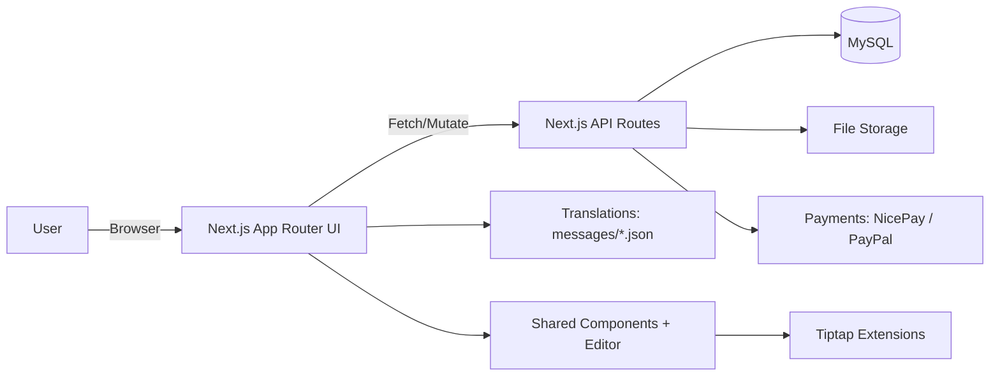
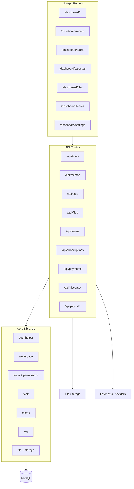
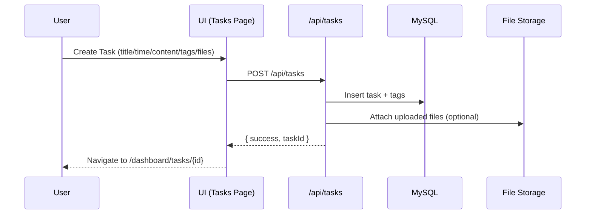

## Project Overview

This project is a multi-workspace SaaS dashboard built with Next.js (App Router). It supports personal and team workspaces with tasks, calendar, rich-text memos, file attachments, tagging, and subscription/billing flows. It is designed to be a reusable foundation for similar productivity or collaboration apps.

### Key Features
- Workspace-based ownership (`personal` / `team`)
- Task management with status, tags, colors, attachments
- Calendar and task list views
- Rich-text editor (Tiptap) with JSON storage
- Memo system with search, sorting, favorites, paging
- Team management and permissions
- Billing & subscriptions (NicePay + PayPal integrations)

### Tech Stack
- Next.js App Router + React
- Tailwind CSS
- Tiptap (rich-text editor)
- MySQL (see `database_setup.sql`)
- API routes under `src/app/api/*`

### Architecture Overview


### Modules Overview


### Data Flow (Task Example)


## Getting Started

First, run the development server:

```bash
npm run dev
# or
yarn dev
# or
pnpm dev
# or
bun dev
```

Open [http://localhost:3000](http://localhost:3000) with your browser to see the result.

You can start editing the page by modifying `src/app/[locale]/page.tsx`. The page auto-updates as you edit the file.

### Useful Pointers
- Dashboard routes: `src/app/[locale]/dashboard/*`
- API routes: `src/app/api/*`
- Shared editor: `src/components/editor/*`
- Data access: `src/lib/*`

### Redis Cache (Local + Server)
- This project now supports Redis read-through cache in `src/lib/redis-cache.ts`.
- If Redis is not configured, it automatically falls back to DB-only mode.
- Local Redis example:
```bash
docker run --name pecal-redis -p 6379:6379 -d redis:7
```
- Recommended env:
```bash
REDIS_URL=redis://127.0.0.1:6379/0
REDIS_TASK_DETAIL_TTL_SEC=30
REDIS_TASK_LIST_TTL_SEC=20
REDIS_TASK_DATE_TTL_SEC=20
REDIS_TAG_LIST_TTL_SEC=120
REDIS_MEMO_LIST_TTL_SEC=20
REDIS_MEMO_DETAIL_TTL_SEC=20
REDIS_FILE_DETAIL_TTL_SEC=60
REDIS_FILE_LIST_TTL_SEC=30
REDIS_FILE_TOTAL_SIZE_TTL_SEC=20
REDIS_ME_WORKSPACES_TTL_SEC=30
REDIS_ME_TEAMS_TTL_SEC=30
REDIS_NOTIFICATIONS_UNREAD_TTL_SEC=10
REDIS_NOTIFICATIONS_LIST_TTL_SEC=10
REMINDER_STREAM_BATCH_SIZE=200
REMINDER_STREAM_MAX_LOOPS=10
REMINDER_SEND_BATCH_SIZE=100
REMINDER_SENT_DEDUPE_TTL_SEC=604800
REMINDER_STREAM_MAXLEN=100000
REMINDER_DEFAULT_TZ_OFFSET_MINUTES=540
EXPO_ACCESS_TOKEN=
```

### Task Reminder Cron
- Endpoint: `POST /api/cron/task-reminders`
- Header: `Authorization: Bearer {CRON_SECRET}`
- Recommended schedule: every 1 minute
- Status check endpoint: `GET /api/cron/task-reminders` (same auth header)

#### Cron health check example
```bash
curl -H "Authorization: Bearer $CRON_SECRET" \
  https://pecal.site/api/cron/task-reminders
```

#### Dev / Prod TTL Recommendation
- Dev:
  - task/list/date: `10~30s`
  - notifications: `5~10s`
  - tags/files: `30~120s`
- Prod:
  - task/detail: `30~60s`
  - task/list/date: `20~45s`
  - notifications: `10~20s`
  - tags/files: `60~300s`

#### Reminder timezone policy
- Reminder scheduler interprets `tasks.start_time` using
  `REMINDER_DEFAULT_TZ_OFFSET_MINUTES` (default `540`, KST).
- Keep this value aligned with your primary user timezone until per-user timezone scheduling is introduced.

#### RRULE scope
- `rrule` is currently persisted only.
- Recurring instance expansion / recurring reminder fan-out is not enabled yet.

#### Reminder E2E checklist
- create (with reminder) -> cron -> `/api/notifications/unread` count 증가
- update reminder -> 이전 트리거 무효화되고 새 시각에만 알림
- delete task -> 해당 task reminder job 삭제
- status DONE -> due 시점에도 reminder 미발송

#### iPhone push reminder
- Mobile app registers Expo push token via `POST /api/me/push-tokens`.
- Cron reminder dispatch writes in-app notifications and also sends Expo push.
- Set `EXPO_ACCESS_TOKEN` in production for higher Expo push throughput and reliability.

## Learn More

To learn more about Next.js, take a look at the following resources:

- [Next.js Documentation](https://nextjs.org/docs) - learn about Next.js features and API.
- [Learn Next.js](https://nextjs.org/learn) - an interactive Next.js tutorial.

You can check out [the Next.js GitHub repository](https://github.com/vercel/next.js) - your feedback and contributions are welcome!

## Deploy on Vercel

The easiest way to deploy your Next.js app is to use the [Vercel Platform](https://vercel.com/new?utm_medium=default-template&filter=next.js&utm_source=create-next-app&utm_campaign=create-next-app-readme) from the creators of Next.js.

Check out our [Next.js deployment documentation](https://nextjs.org/docs/app/building-your-application/deploying) for more details.

### Recent Changes
- Member profile images (upload/remove) and avatar display in sidebar.
- Timezone settings now support auto-detect + manual override.
- Billing plans split into personal/team pages with team selection.
- Memo loading UX improved to avoid stuck loading state.
- Mini calendar shows task colors.

### Nicknames
- Nicknames are unique (DB constraint).
- Auto-generated on signup based on locale (`NEXT_LOCALE`).
- Updates reject duplicates with 409.
